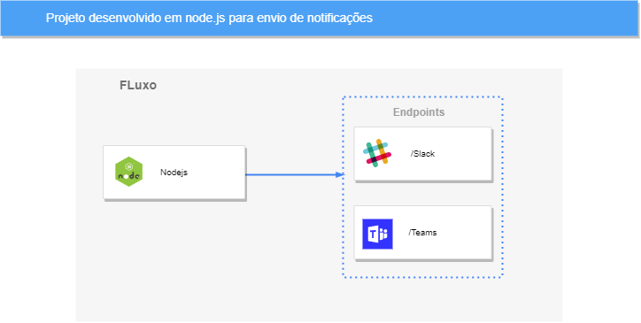

# Notificação 
Projeto desenvolvido para envio de notificações para uma canal do Slack ou grupo do Microsoft Teams




## Configuração de chaves do Slack

Para enviar mensagem para um canal do Slack, será necessário criar um bot e dar permissão a ele do canal que será notificado. Para esta configuração você poder seguir os passos deste link: [liberação canal slack](https://api.slack.com/apps/A04GY9H4WJ2/oauth), clique em Reinstall to Workspace e selecione o canal que deseja dar permissão. 

Em seguida você precisa o Id do canal [Link para pegar o id do seu canal](https://help.socialintents.com/article/148-how-to-find-your-slack-team-id-and-slack-channel-id).


### Enviando notificação para Slack

Para enviar notificação você pode utilizar o exemplo do curl a seguir:

```
curl --location --request POST 'http://localhost:3000/slack' \
--header 'Content-Type: application/json' \
--data-raw '{
    "channelId":"seu canal",
    "message":"sua mensagem"
}'
```

## Confirguração de webhook do teams

Para criar um Webhook você pode seguir os passos deste link [WebHook Microsoft Teams](https://learn.microsoft.com/en-us/microsoftteams/platform/webhooks-and-connectors/how-to/add-incoming-webhook)


### Exemplo de envio de mensagem para o Microsoft Teams

Para enviar notificação você pode utilizar o exemplo do curl a seguir:

```
curl --location --request POST 'http://localhost:3000/teams' \
--header 'x-token-auth: WebHook do canal do seu teams' \
--header 'Content-Type: application/json' \
--data-raw '{
    "title":"Titulo da mensagem",
    "message":"Texto da mensagem"
}'
```


